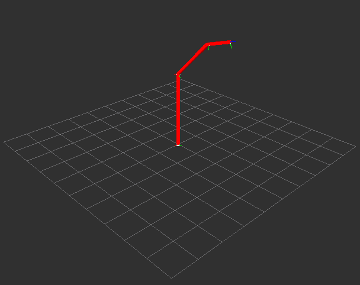

# ROS ThreeSeg
Simple URDF visualizer for a three DOF robot arm.



### 1 
Add to a ROS workspace. 

### 2
Source.
```sh
source devel/setup.sh
```

### 3
Launch *visualize.launch*.
```sh
roslaunch visualize.launch
rosrun rviz rviz
```

### 4
Inside RVIZ do Add->RobotModel and Add->TF.

#### Resource
http://wiki.ros.org/urdf/Tutorials/Using%20urdf%20with%20robot_state_publisher

